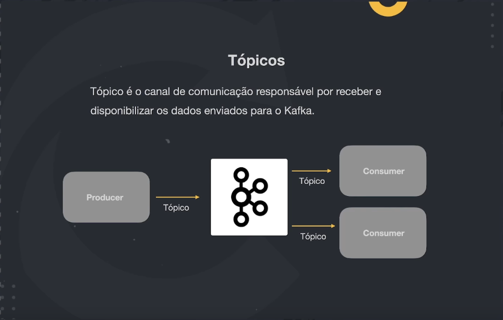

# Anotações sobre a aula 2

## Apache Kafka

### Dinâmica de funcionamento

- Producer: é o sistema que vai enviar o evento/mensagem. 
- Apache Kafka: Funcionamento estilo cluster, onde cada máquina é conhecida como Broker.
- Broker: Cada broker tem seu próprio banco de dados.
- Costumer: Lê os valores do Kafka, procurando eventos/mensagens específicas.

### Tópicos

Podemos criar um "tópico" no Kafka, que seria semelhante à um canal, onde serão armazenadas um tipo de mensagens, como por exemplo, um tópico de vendas. As mensagens são persistidas em disco, não em RAM.

### Registro

São a forma das mensagens enviadas nos tópicos.

- Header: Podemos passar métadados, para utilizar essa informação de alguma forma;
- Key: Podemos utilizar para as mensagens sempre terem uma ordem desejada;
- Value: Payload da mensagem;
- Timestamp: timestamp da mensagem.

### Partições

As partições são fragmentos de um tópico, sendo assim, elas seriam como uma "lista dividida". Nossos dados originais são: `[a, b, c, d, e, f]`. No caso de termos dois Brokers, poderia acontecer de dividirmos nossa partição em duas, sendo assim `[a, b, c]` e `[d, e, f]`. Sendo assim, no Broker A, teriamos `[a, b, c]` e no Broker B teriamos `[d, e, f]`.

Cada tópico pode ter uma ou mais partições, e estas partições podem estar espalhadas em um ou mais Brokers, sendo assim, caso um Broker caia, você não perderá acesso à todos os dados de um tópico.

Porém, podemos setar um `Replication Factor = x`, que irá replicar nossa partição em `x`, tendo um comportamento semelhante aos pods do Kubernetes, mantendo uma resiliencia dos dados, já que caso um dos Brokers que armazena a partição caia, você ainda terá acesso à uma cópia por outro Broker.

### Consumer

Independentemente de quantos Brokers as partições de um tópico estejam, o Consumer lê as partições sequencialmente (ou seja, lê o tópico) em busca da informação procurada.

Também podemos ter `Consumers Groups`, onde criamos mais de uma máquina rodando exatamente o mesmo software, como vários pods de um mesmo objeto no Kubernetes, com o objetivo de fracionar a responsabilidade de processar as partições. Então, podemos fazer com que meu Consumer A leia a partição 1, ou as partições de 1 a 4, enquanto meu consumer B leia a partição 2, ou as partições de 5 a 10. O objetivo dos `Consumers Groups` é evitar um gargalo no sistema, onde chegam mais mensagens do que efetivamente são processadas.

## gRPC

É um framework desenvolvido pela google, com o objetivo de facilitar a comunicação entre sistemas, de uma forma extremamente rápida, e que independe de linguagens de programação.

É recomendado ser utilizado em microsserviços, backend ou mobile. Existe um projeto chamado gRPC Web, para ser utilizado em browser, mas o projeto ainda está no seu começo, então seu uso não é recomendado.

### Protocol Buffers

Pode ser utilizada em qualquer plataforma e em qualquer linguagem. Ajuda para serializar a informação, parecido com o XML, porém mais leve, menor, e muito mais rápido. Também é serializado em binário.

#### vs Json

Gasta menos recursos em relação ao JSON, o processo de serialização também é mais leve (em termos de custo de CPU), gasta menos recursos de rede, além de ser mais veloz.

### HTTP/2

Utiliza o protocolo HTTP/2 para trafegar os dados, que no caso, utiliza binários ao invés de plain text para trafegar as informações.

### Métodos de acesso à api

- API "unary": Maneira mais simples de se fazer uma requisição, conforme estamos acostumados. É enviado uma requisição ao server, que retorna uma resposta.
  
- API "Server streaming": Ao invés de simplesmente encerrar a conexão após o retorno da resposta do servidor, podemos enviar várias respostas, até efetivamente encerrá-la.
  
- API "Client streaming": Podemos abrir uma requisição e ir enviando informações aos poucos para o servidor, que poderá ir pré processando a informação. Por fim enviará uma resposta encerrando a conexão.
  
- API "Bi directional streaming": Funcinona como um merge dos dois últimos tópicos, podendo fragmentar tanto as informações enviadas pelo cliente, quanto as informações enviadas pelo servidor.
  

### REST vs gRPC

